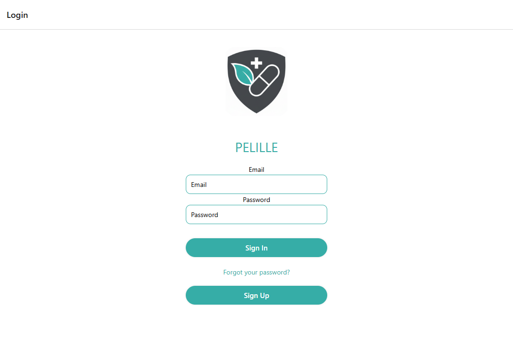

# Pilelle

**Pilelle** is a minimal React Native app designed for quickly checking potential interactions between foods and medicines, or between multiple medicines.  

The app focuses on simplicity and speed, providing users with a history of their **last 10 interaction checks**. Future versions will leverage AI to provide more comprehensive insights and personalized guidance.

<p align="center">
  
</p>

---

## Features

- Quick lookup for **medicine–medicine** or **food–medicine** interactions  
- Maintains a **history of the 10 most recent searches** per user  
- Simple and minimal **mobile-friendly UI**  
- Supabase authentication (email/password)  
- Supports both **iOS and Android** via Expo  
- Future AI integration for enhanced responses  

---

## Screens

1. **Home** – Enter two items to check for interactions.  
<p align="center">
  
</p>
2. **Results** – Shows the interaction details and a summary.  
<p align="center">
  
</p>
3. **History** – Displays your 10 most recent checks; allows clearing history.  
<p align="center">
  
</p>
4. **Login** - Users sign back into the app.
<p align="center">
  
</p>
5. **SignUp** - New users register for the app.
<p align="center">
  
</p>

---

## Tech Stack

- **Frontend:** React Native (Expo)  
- **Backend / Database:** Supabase  
- **Authentication:** Supabase email/password  
- **Data Source:** OpenFDA API (currently mocked for MVP)  
- **Icons & UI:** Ionicons, basic React Native components  

---

## Installation

1. Clone the repository:

```bash
git clone https://github.com/yourusername/pilelle.git
cd pilelle
```

2. Install dependencies:

```bash
npm install
```

3. Create a `.env` file in the project root with your Supabase keys:

```
SUPABASE_URL=your-supabase-url
SUPABASE_KEY=your-supabase-key
```

4. Start the app:

```bash
expo start
```

---

## Usage

1. Open the app on your device or simulator.  
2. Enter two medicines or a medicine and a food item on the Home screen.  
3. Tap **Check Interaction** to view results.  
4. Navigate to the History screen to view your 10 most recent checks.  
5. Clear history using the **Clear History** button if desired.  

---

## Next Features

Future contributions may include:

- AI-based interaction analysis  
- Enhanced UI and theming  
- Expanded data sources for more comprehensive coverage  

---

## License

MIT License. See `LICENSE` for details.